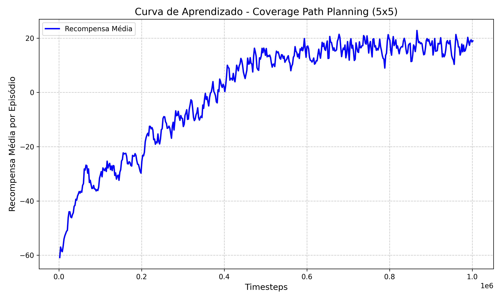
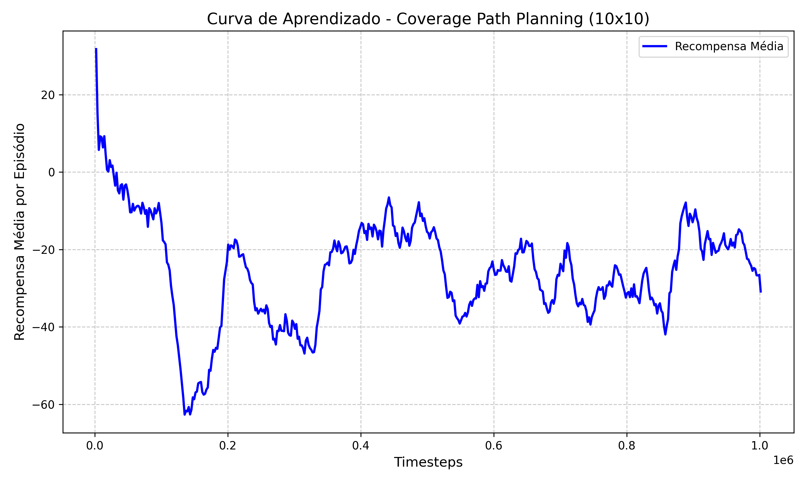

# Relatório de Desenvolvimento: Agente de Coverage Path Planning (CPP) - V2

Este documento registra o progresso e a análise de desempenho do agente de Aprendizado por Reforço (RL) utilizando **PPO**, incorporando os resultados reais de treinamento e avaliação.

## 1. Descrição do Problema
O objetivo é desenvolver um agente capaz de realizar a cobertura completa de um grid com obstáculos, operando sob a restrição de **observabilidade parcial**. O agente deve aprender a mapear o ambiente e visitá-lo integralmente com o mínimo de passos.

---

## 2. Estratégia de Melhoria (Iteração 1)
As modificações iniciais focaram em aumentar a percepção local e a capacidade de processamento da rede neural:
* **Radar 5x5:** Expansão da matriz de vizinhos para reduzir a "miopia" do agente.
* **Rede Neural Profunda:** Camadas de 256 neurônios para capturar relações espaciais complexas.
* **Gamma (0.999):** Ajustado para valorizar a recompensa final de longo prazo (cobertura total).

---

## 3. Resultados da Avaliação

Abaixo estão os dados reais coletados após a bateria de 100 episódios de teste.

### Tabela de Desempenho Atualizada
| Cenário | Taxa de Sucesso (100%) | Cobertura Média | Passos Médios |
| :--- | :---: | :---: | :---: |
| **Grid 5x5** | 79.0% | 93.82% | 61.2 |
| **Grid 10x10** | 0.0% | 72.68% | 400.0 (Timeout) |
| **Grid 20x20** | - | Modelo não encontrado | - |

### Curvas de Aprendizado
As curvas abaixo mostram a evolução da recompensa média (`ep_rew_mean`) durante o treinamento. Nota-se que no 10x10 a rede atinge um platô negativo, indicando que o agente "se perde" no mapa após limpar a vizinhança inicial.

*Figura 1: Progresso do treinamento no ambiente 5x5.*

*Figura 2: Estagnação do aprendizado no ambiente 10x10 devido à falta de sinal global.*

---

## 4. Análise Crítica e Plano de Ação
Os dados confirmam que:
1.  No **5x5**, a cobertura média de **93.82%** indica que o agente limpa quase todo o mapa, mas falha em encontrar a última célula por falta de uma "memória" ou sinal de direção de longo alcance.
2.  No **10x10**, a taxa de sucesso de **0%** e cobertura de **72.68%** provam que a estratégia puramente local não escala. O agente entra em timeout (400 passos) preso em áreas já visitadas.

**Nova Estratégia para o Ponto Extra (20x20):**
Para quebrar essa barreira, implementaremos no próximo passo:
* **Bússola Vetorial:** Injeção de um vetor relativo que aponta para a célula não visitada mais próxima.
* **Reward Shaping:** Recompensa baseada em potencial para guiar o agente em direção à "sujeira" mesmo quando ela não está visível no radar.

---
*Relatório atualizado em 07/05/2026.*