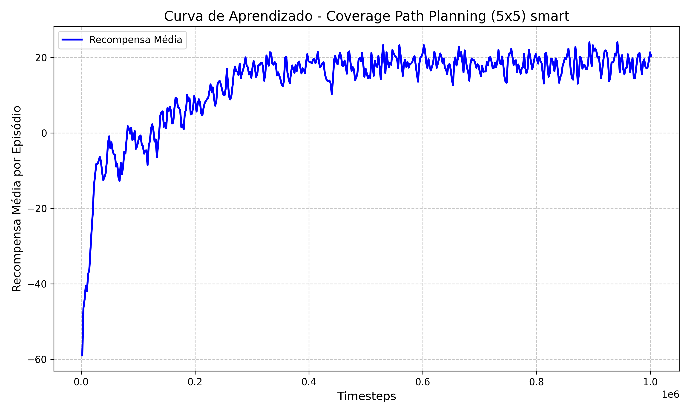
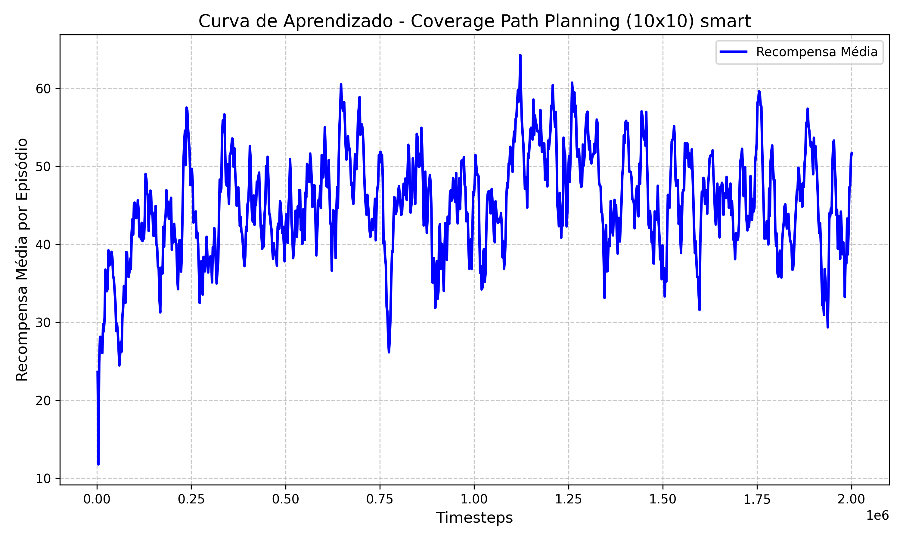
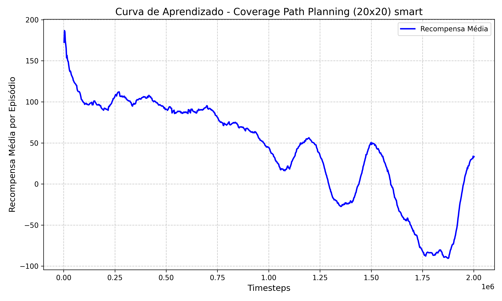

# Relatório de Desenvolvimento: Agente de Coverage Path Planning (CPP) com PPO

Este documento registra a evolução técnica, as estratégias de modelagem e a análise de desempenho de um agente de Aprendizado por Reforço (RL) desenvolvido para resolver o problema de cobertura de área em ambientes parcialmente observáveis.

## 1. Descrição do Problema

O desafio consiste em treinar um agente capaz de realizar a cobertura completa de um grid contendo obstáculos aleatórios. A restrição fundamental é a **observabilidade parcial**: o agente não conhece o mapa *a priori* e possui uma visão limitada ao seu redor, devendo aprender a navegar de forma eficiente para visitar todas as células livres.

## 2. Metodologia: O Algoritmo PPO

A solução utiliza o algoritmo **Proximal Policy Optimization (PPO)**, uma técnica de *Policy Gradient* que se destaca pela estabilidade no treinamento.

* **Função Clipped Objective**: O PPO evita atualizações bruscas nos parâmetros da política ao manter a razão entre a nova e a antiga política dentro de um intervalo $[1 - \epsilon, 1 + \epsilon]$, garantindo um aprendizado mais robusto e estável.
* **Arquitetura Actor-Critic**: Implementamos uma rede profunda com camadas de 256 neurônios tanto para o Ator (que decide a ação) quanto para o Crítico (que estima o valor do estado para reduzir a variância).
* **Coeficiente de Entropia**: Definido em `0.05` para incentivar a exploração ativa do mapa, garantindo que o agente tente novas rotas antes de convergir para uma política determinística.

## 3. Evolução das Iterações

### Iteração 1: Agente "Dumb" (Míope)

Focada em percepção local com um **Radar 5x5**. O agente recebe apenas a matriz de vizinhança imediata.

* **Limitação**: Sem um sinal global, o agente entra em loop infinito quando todas as células no radar 5x5 já foram visitadas, resultando em *timeout*.

### Iteração 2: Agente "Smart" (Bússola Vetorial)

Introduzimos um sensor de direção global (**Bússola**) no espaço de observação.

* **Bússola Vetorial**: Um vetor $(X, Y)$ normalizado que aponta continuamente para a célula livre não visitada mais próxima.
* **Filosofia de Recompensa**: Seguindo o estado da arte (SOTA), removemos o *Reward Shaping* positivo de distância para evitar **Mínimos Locais**. O agente aprende a usar a bússola apenas como informação, tendo liberdade para se afastar momentaneamente do alvo para contornar obstáculos complexos.

## 4. Rigor na Avaliação: Determinismo vs. Estocasticidade

Diferente da *baseline* original que utilizava `deterministic=False` (introduzindo ruído aleatório para "ajudar" o robô a escapar de loops por sorte), este projeto utiliza **`deterministic=True`**. Isso garante que os resultados reflitam a inteligência real da política aprendida, e não a sorte de movimentos aleatórios para cobrir o mapa.

## 5. Resultados Finais

O treinamento foi realizado via **Curriculum Learning**, transferindo o conhecimento do ambiente 5x5 para o 10x10 e, finalmente, para o 20x20.

### Tabela Comparativa de Desempenho

| Cenário | Tipo | Taxa de Sucesso | Cobertura Média | Passos Médios |
| --- | --- | --- | --- | --- |
| **5x5** | Dumb | 80.0% | 94.14% | 59.5 |
| **10x10** | Dumb | 0.0% | 74.86% | 400.0 (Timeout) |
| **5x5** | **Smart** | **84.0%** | **97.32%** | **52.5** |
| **10x10** | **Smart** | **36.0%** | **86.52%** | **293.3** |
| **20x20** | **Smart** | **0.0%** | **29.20%** | **800.0 (Timeout)** |

---

## 6. Análise Gráfica do Treinamento

Os gráficos abaixo ilustram as curvas de aprendizado extraídas do TensorBoard.

### A. Cenários 5x5 e 10x10

O agente *Smart* apresenta uma convergência clara de recompensa e uma redução drástica na duração do episódio (`ep_len_mean`) no 10x10, provando que a bússola resolveu o problema do loop infinito.

* **5x5 Smart:** 
 
* **10x10 Smart:** 
 

### B. Cenário 20x20

A estabilização em 800 passos com recompensa negativa reflete o custo acumulado de tempo e a presença de células inacessíveis.

* **20x20 Smart:** 
 

---

## 7. Análise Crítica dos Resultados

### O Sucesso do Agente Smart no 10x10

O agente Smart elevou a cobertura média de **74.8% para 86.5%**. A taxa de sucesso de 36% é explicada pela geometria: em mapas aleatórios, obstáculos frequentemente isolam células livres. A redução nos passos médios (de 400 para 293) prova uma navegação muito mais eficiente.

### O Desafio do Ambiente 20x20

O desempenho no grid 20x20 revela os limites da observabilidade parcial:

1. **Miopia de Escala**: Um radar 5x5 cobre apenas **6,25%** da área de um mapa 20x20.
2. **Células Inacessíveis**: Com 48 obstáculos, quase todo episódio contém áreas bloqueadas. O robô usa a bússola para tentar chegar a essas áreas e "insiste" até o fim do tempo (800 passos), o que explica o *timeout* constante.

## 8. Como Rodar os Códigos

Este projeto utiliza `uv` para gestão de dependências.

### Treinamento Base (5x5)

```bash
uv run src/train_grid_world_cpp.py train smart 5 3 200 1000000

```

### Curriculum Learning (10x10)

```bash
uv run src/train_grid_world_cpp.py curriculum smart 10 12 400 2000000

```

### Avaliação

```bash
uv run src/evaluate_all.py

```

---

*Relatório finalizado em 08/05/2026.*
